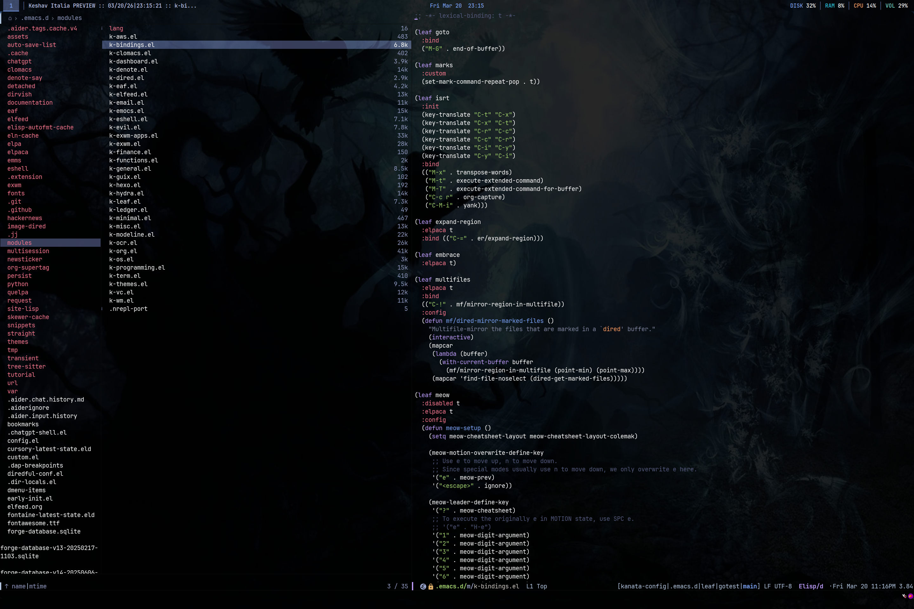
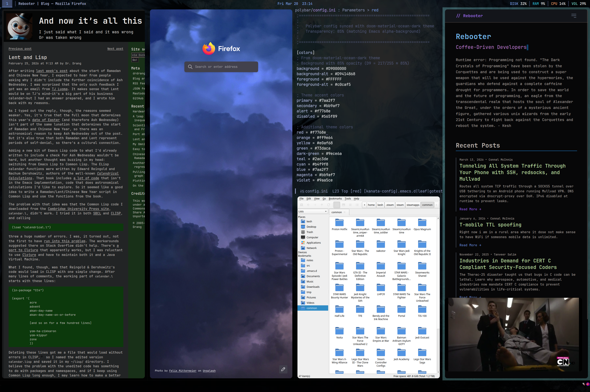
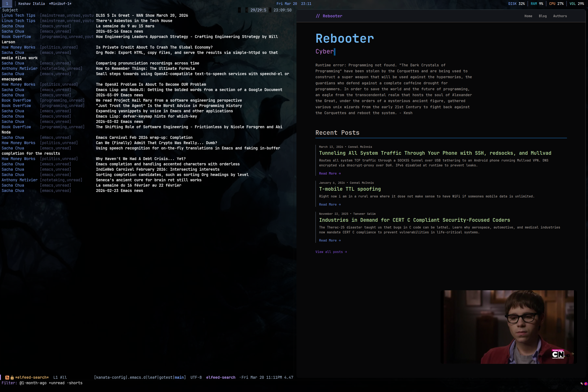
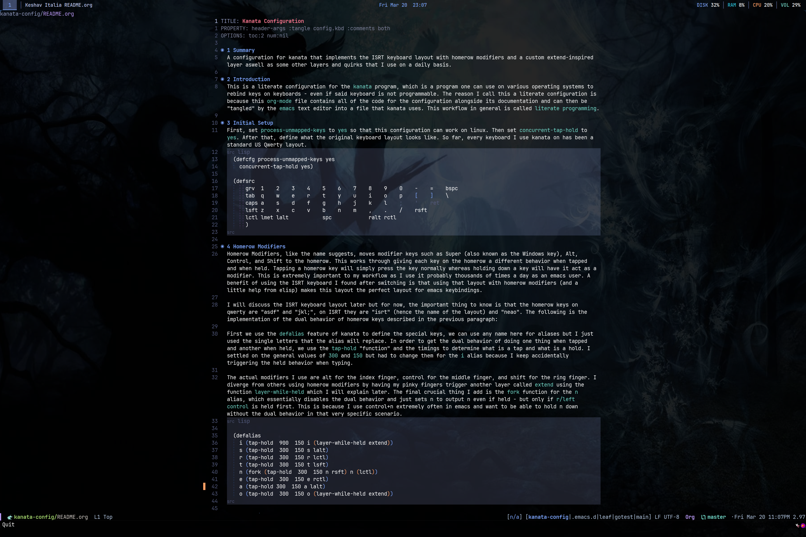
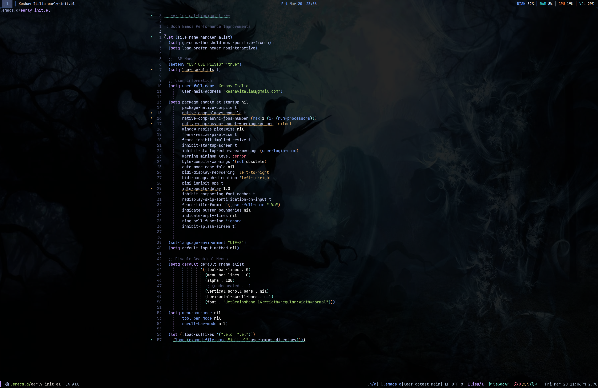

#+TITLE: Kesh's Emacs Configuration

* Introduction
This is my emacs configuration, it is very specific to my preferences and use-cases, many of which are very niche.

* Noteable Features

** ISRT Keyboard Layout
I use the ISRT keyboard layout with homerow modifiers and a few other features. This emacs configuration is optimized for that. C-x and M-x are swapped with C-t and M-t and vice versa so that both can be typed with on the homerow. Similarly, C-c is swapped with C-r and C-y with C-i for the same reason.

** Advanced EXWM Configuration
This is all very much a heavy WIP and not fully implemented yet.
- Using window margins, I have gaps between exwm windows
- Simulation keys to get my emacs keybindings everywhere
- Perspective.el and Project.el integration
- Experimenting with scripting elisp with OCR
- BSPWM-style layout
- Using Xephyr to run another WM inside of EXWM

* Other Packages I Use Often
- Dirvish
- Magit
- Elfeed + Elfeed-Tube + Elfeed-Tube-MPV
- Embark, Marginilia, Orderless, Vertico
- Denote + HOWM

* Screenshots

* Installation

** GNU Guix
I like to use GNU Guix to install emacs on systems where it is available. If I'm forced to use windows, I just downloaded the latest version built. I don't put much effort into being on the bleeding edge but I do tend to use the latest version of emacs before it is officially released.

*** Guix Channels
This is my =channels.scm=
#+begin_src scheme
  (list (channel
         (name 'guix)
         (url "https://git.savannah.gnu.org/git/guix.git")
         (branch "master")
         (introduction
          (make-channel-introduction
           "9edb3f66fd807b096b48283debdcddccfea34bad"
           (openpgp-fingerprint
            "BBB0 2DDF 2CEA F6A8 0D1D  E643 A2A0 6DF2 A33A 54FA"))))
        ;; (channel
        ;; (name 'kesh-guix)
        ;; (url "file:///home/kesh/src/guix-packages"))
  	  (channel
         (name 'nonguix)
         (url "https://gitlab.com/nonguix/nonguix")
         ;; Enable signature verification:
         (introduction
          (make-channel-introduction
           "897c1a470da759236cc11798f4e0a5f7d4d59fbc"
           (openpgp-fingerprint
            "2A39 3FFF 68F4 EF7A 3D29  12AF 6F51 20A0 22FB B2D5"))))
  	  (channel
  	   (name 'guixrus)
  	   (url "https://git.sr.ht/~whereiseveryone/guixrus")
  	   (introduction
  		(make-channel-introduction
  		 "7c67c3a9f299517bfc4ce8235628657898dd26b2"
  		 (openpgp-fingerprint
  		  "CD2D 5EAA A98C CB37 DA91  D6B0 5F58 1664 7F8B E551"))))
  	  )
#+end_src

*** Emacs Package Definition
#+begin_src scheme
  (use-modules (guix packages)
  			 (guix utils)
  			 (guix gexp)
  			 (gnu packages base)
  			 (gnu packages sqlite)
  			 (gnu packages webkit)
               (gnu packages emacs)
  			 (gnu packages xorg)
  			 ((guixrus packages gcc) #:prefix rus:))

  (define-public k-emacs
    (let ((libgccjit rus:libgccjit-11))
  	(package
  	 (inherit emacs-next)
  	 (version "master")
  	 (name "k-emacs")
  	 (arguments
  	  (substitute-keyword-arguments (package-arguments emacs-next)
  									((#:configure-flags ''())
  									 #~(cons*
  										"--without-compress-install"
  										"--with-native-compilation=yes"
  										"--with-json"
  										"--with-sqlite3"
  										"--with-xinput2"
  										"--with-xwidgets"
  										"--with-tree-sitter"
  										"--with-modules"
  										"--with-threads"
  										"--with-imagemagick"
  										#$flags))
  									((#:phases phases ''())
  									 #~(modify-phases #$phases
  													  ;; Required for configure to find libgccjit
  													  (add-before 'configure 'set-library-path
  																  (lambda* (#:key inputs #:allow-other-keys)
  																	(let* ((libgccjit-version
  																			#$(package-version
  																			   (this-package-input "libgccjit")))
  																		   (libgccjit-libdir
  																			(string-append
  																			 #$(this-package-input "libgccjit")
  																			 "/lib/gcc/" %host-type "/" libgccjit-version)))
  																	  (setenv "LIBRARY_PATH"
  																			  (string-append libgccjit-libdir ":"
  																							 (getenv "LIBRARY_PATH"))))
  																	#t))
  													  ;; Add runtime library paths for libgccjit.
  													  (add-after 'unpack 'patch-driver-options
  																 (lambda* (#:key inputs #:allow-other-keys)
  																   (substitute* "lisp/emacs-lisp/comp.el"
  																				(("\\(defcustom native-comp-driver-options nil")
  																				 (format
  																				  #f "(defcustom native-comp-driver-options '(~s ~s ~s ~s)"
  																				  (string-append
  																				   "-B" #$(this-package-input "binutils") "/bin/")
  																				  (string-append
  																				   "-B" #$(this-package-input "glibc") "/lib/")
  																				  (string-append
  																				   "-B" #$(this-package-input "libgccjit") "/lib/")
  																				  (string-append
  																				   "-B" #$(this-package-input "libgccjit") "/lib/gcc/"))))
  																   #t))))))
  	 (inputs (modify-inputs (package-inputs emacs-next)
  							(prepend
  							 glibc
  							 libgccjit
  							 sqlite
  							 webkitgtk-with-libsoup2
  							 libxrender
  							 libxt))))))

  k-emacs

#+end_src

** ISRT Keyboard Layout
I have a ZSA Voyager keyboard and an Ergodox EZ that are both programmed with my custom layout that uses ISRT. However I also use Kanata to make sure I can still use the layout even when on a laptop or using a keyboard that isn't programmable. The Kanata configuration is a literate config and also on my github account.

** Locally running Searxng
I also locally run an instance of searxng. I will elaborate more on how it integrates with emacs configuration here in the future but you can find my repo for my searxng instance aswell as many other components of my EXWM desktop on my github page.
